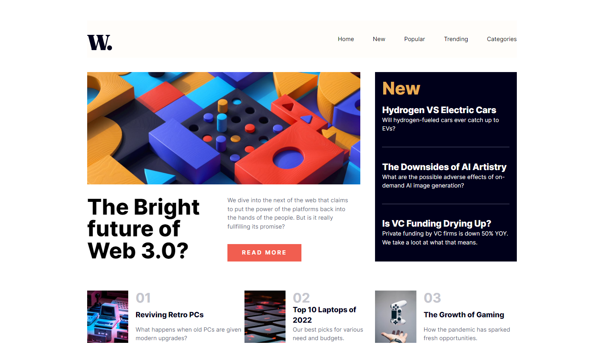
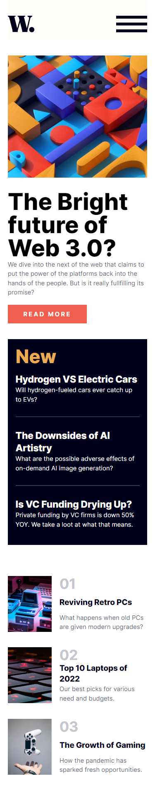
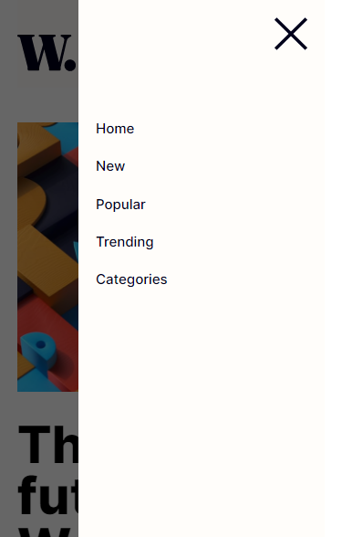

# Frontend Mentor - News homepage solution

This is a solution to the [News homepage challenge on Frontend Mentor](https://www.frontendmentor.io/challenges/news-homepage-H6SWTa1MFl). Frontend Mentor challenges help you improve your coding skills by building realistic projects. 

## Table of contents

- [Overview](#overview)
  - [The challenge](#the-challenge)
  - [Screenshot](#screenshot)
  - [Links](#links)
- [My process](#my-process)
  - [Built with](#built-with)

## Overview
This is a simple website using React, Vite and Tailwind. Is completly responsive

### The challenge

Users should be able to:

- View the optimal layout for the interface depending on their device's screen size
- See hover and focus states for all interactive elements on the page

### Screenshot

#### Desktop design

#### Mobile desing
##### Page

##### Menu

### Links

- Solution URL: [Add solution URL here](https://your-solution-url.com)
- Live Site URL: [Add live site URL here](https://your-live-site-url.com)

## My process

First I noted the components that the page has and then building them one by one with their particular styles, identifying 4 bigger components, which are:
- Navbar
- Main News Article
- Recent News Articles: this is made of another subcomponent of a single recent article.
- List Articles: this is made of another subcomponent of a single list article

### Built with

- Semantic HTML5 markup
- CSS custom properties
- Flexbox
- [React](https://reactjs.org/) - JS library
- [Vite](https://vitejs.dev) - JS Build tool
- Typescript
- Tailwind

